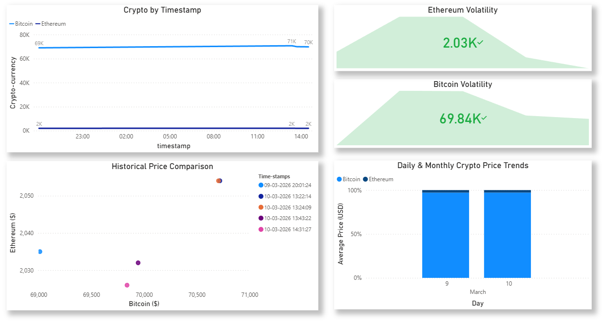

# 🚀 Serverless Crypto Analysis Using AWS and Power BI


## 📌 Project Overview

This project demonstrates a fully functional, serverless cloud data pipeline built entirely within the AWS Free Tier. It automates the collection of real-time cryptocurrency data (Bitcoin & Ethereum) from the CoinGecko API, stores it in an Amazon S3 data lake, and enables direct SQL querying via Amazon Athena for interactive visualization in Power BI.

The goal of this project was to replicate real-world **data engineering and analysis workflows**, focusing on automated data ingestion, secure cloud storage, dynamic SQL querying, and business intelligence integration.

---

## 📂 Repository Structure

Files in this repository:

* **`aws_bi/`** – Power BI dashboard folder containing your final interactive visualization.
* **`data_analysis_using_aws.pdf`** – Comprehensive project documentation detailing architecture, setup process, challenges, and learnings.
* **`crypto_tracker.py`** – Python script to fetch real-time crypto data locally from CoinGecko API.
* **`lambda_function.py`** – Deployed AWS Lambda function to fetch, and upload CSV data to S3.
* **`crypto_data.csv`** – Sample dataset generated by the API, demonstrating the stored data structure.

---

## 🏗️ Architecture & Technologies

**Stack Used:**

* Data Source: CoinGecko API
* Compute / Ingestion: AWS Lambda (Python 3.x, `boto3`)
* Data Storage: Amazon S3
* Analytics / Querying: Amazon Athena
* Data Visualization: Microsoft Power BI
* Security / Access: AWS IAM (Roles & ODBC credentials)

---

## ⚙️ How It Works

### 1️⃣ Data Ingestion (AWS Lambda)

`lambda_function.py` fetches current market prices from the CoinGecko API. Steps:

1. Makes an HTTP request to the API.
2. Parses the JSON response.
3. Formats the data into CSV with timestamp: `crypto_YYYYMMDD_HHMMSS.csv`.
4. Uploads CSV to **S3 bucket**.

---

### 2️⃣ Data Storage (Amazon S3)

S3 bucket organized to separate **data** from **metadata**:

```text
adarsh-aws-project-bucket/
  ├── c_data/              # CSV files only
  ├── metadata_crypto/     # Athena query metadata
  └── temp/
```

---

### 3️⃣ Querying (Amazon Athena)

Athena queries CSVs directly from the `c_data/` folder. Example:

```sql
SELECT * FROM "crypto_db.crypto_data_new" ;
```

The table dynamically reads any new CSV added by Lambda - no rebuild needed.

---

### 4️⃣ Dashboard Visualization (Power BI)

Power BI connects to Athena using the ODBC driver authenticated via IAM credentials.



---

## 🐛 Challenges & Troubleshooting

### 1. Athena NULL Rows

**Cause:** Athena scanned non-data files in the S3 bucket.  
**Fix:** Created a dedicated `c_data/` folder for CSVs and updated Athena table to point to this folder.

### 2. Lambda Timeout

**Cause:** Default 3-second timeout insufficient for API request.  
**Fix:** Increased Lambda timeout to 10 seconds.

---

## 🚀 Future Improvements

* Automate Lambda with Amazon EventBridge.
* Use AWS Glue for robust ETL transformations.
* Connect Amazon QuickSight for real-time dashboards.
* Explore larger datasets in Amazon Redshift.


